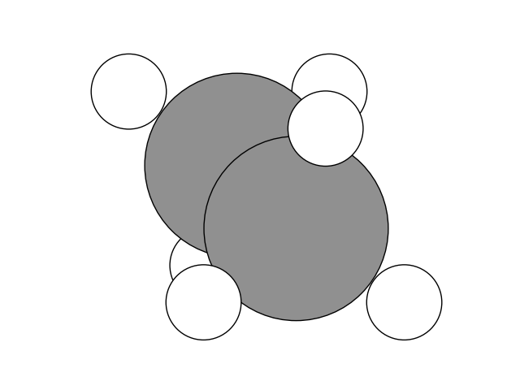

:orphan:
..
  _.. _delta_learning:

====================================
Ethane rotation using delta-learning
====================================

As a simple example the rotation of a single methyl-group in ethane
is used here. 

The "high" accuracy calculations will be carried out 
using the XTB-Calculator and simple approximations are provided by 
the EMT-Calculator. The initial trajectory is generated by the 
following few lines of code:

.. literalinclude:: ethane_prep.py

Standard nudged elastic band
----------------------------

First the standard ASE NEB-implementation is tested as a benchmark:

.. literalinclude:: ethane_noml.py

This reaches convergence after 35 evaluations of the band:

.. code-block:: none

       Step     Time          Energy         fmax
  *Force-consistent energies used in optimization.
  FIRE:    0 11:26:33     -199.106832*       3.6522
  FIRE:    1 11:26:34     -199.355498*       1.2070
  FIRE:    2 11:26:35     -199.466447*       1.3193
  FIRE:    3 11:26:36     -199.447761*       1.4428
  ...
  FIRE:   33 11:26:58     -199.519629*       0.0831
  FIRE:   34 11:26:58     -199.519847*       0.0657
  FIRE:   35 11:26:59     -199.520063*       0.0310
  

Machine learning accelerated nudged elastic band
------------------------------------------------
 
For the machine learning accelerated version a simple Cartesian Gaussian
process regression calculator is used in combination with the squared
exponential kernel:

.. literalinclude:: ethane_gpr.py

The machine learning based algortihm reaches convergence after 6 evaluations
of the band:

.. code-block:: none

  r_max = 1.27
  Maximum force per image after 1 evaluations of the band:
  [1.13098622 2.88214798 3.65218027 2.88214798 1.13098622]
  Fit called with 7 geometries.
  Starting hyperparameter optimization 1/1 with parameters:  [1.]
  Finished hyperparameter optimization after 8 iterations  with value:  236.2771117587019  and parameters: [0.79388564]
  Fit finished. Final RMSE energy = 0.000038, RMSE force = 0.000002.
  Starting machine learning neb run.
  Switching to climbing image NEB
  Starting machine learning neb run.
  Maximum force per image after 2 evaluations of the band:
  [4.51560526 4.52113597 4.54003155 0.68519066 6.93079255]
  ...
  Maximum force per image after 5 evaluations of the band:
  [0.45934388 0.04299172 0.07692873 0.05450005 0.0926567 ]
  Fit called with 27 geometries.
  Starting hyperparameter optimization 1/1 with parameters:  [0.48269805]
  Finished hyperparameter optimization after 2 iterations  with value:  390.879729549227  and parameters: [0.49364595]
  Fit finished. Final RMSE energy = 0.000087, RMSE force = 0.000001.
  Starting machine learning neb run.
  Switching to climbing image NEB
  Starting machine learning neb run.
  Maximum force per image after 6 evaluations of the band:
  [0.01446804 0.014572   0.01471004 0.01690859 0.01488233]
  Converged after 6 evaluations of the band.
  
Delta-learning
--------------

Delta-learning can easily be included by providing a so-called mean model to the GPR-Calculator (EMT in this case):

.. literalinclude:: ethane_mean.py

Note, however, that using delta-learning does not guarantee faster convergence. This could be due to several different factors, including: large deviations (deltas) between the two potential energy models, the need for different hyperparameters, or less isotropic energy surfaces.  

In the presented example the inclusion of the mean model increases the number of evaluations to 30. This is most likely due to the fact that the length scale hyperparameter is more difficult to optimize.

.. code-block:: none
  
  r_max = 1.78
  Maximum force per image after 1 evaluations of the band:
  [2.42859174 2.75609116 2.59076736 2.75610028 2.42858929]
  Fit called with 7 geometries.
  Starting hyperparameter optimization 1/1 with parameters:  [1.]
  Finished hyperparameter optimization after 7 iterations  with value:  395.51658515955853  and parameters: [0.83316359]
  Fit finished. Final RMSE energy = 0.000001, RMSE force = 0.000000.
  Starting machine learning neb run.
  Image 5 exceeded r_max at step 87. Resetting to previous step.
  Maximum force per image after 2 evaluations of the band:
  [ 3.6699372   5.01027242 35.61636939 54.03545611 50.83240065]
  ...
  Maximum force per image after 29 evaluations of the band:
  [0.02206645 0.00847903 0.05917445 0.01842141 0.04324206]
  Fit called with 147 geometries.
  Starting hyperparameter optimization 1/1 with parameters:  [0.16160878]
  Finished hyperparameter optimization after 0 iterations  with value:  2008.4747729997057  and parameters: [0.16160878]
  Fit finished. Final RMSE energy = 0.000095, RMSE force = 0.000002.
  Starting machine learning neb run.
  Switching to climbing image NEB
  Starting machine learning neb run.
  Maximum force per image after 30 evaluations of the band:
  [0.00333753 0.0043507  0.03491709 0.02422764 0.02263937]
  Converged after 30 evaluations of the band.

