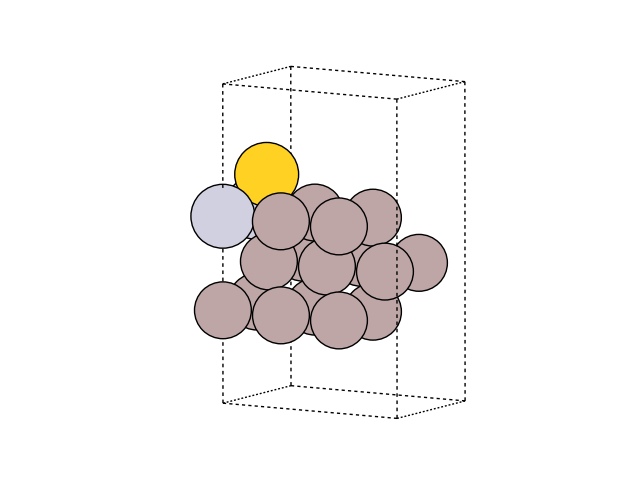

.. _diffusion:

===============================
Diffusion benchmark by Peterson
===============================

In Petersons `original publication <https://aip.scitation.org/doi/abs/10.1063/1.4960708>`_ on machine learning accelerated nudged elastic band the method is first tested on a simple benchmark of a gold atom moving on a Al-Pt slab.

The initial guess for the trajectory visualized above can be generated using the following snippet:

.. literalinclude:: diffusion1.py

Standard nudged elastic band
----------------------------

A calculation with the ASE standard NEB method can be run in a few lines:

.. literalinclude:: diffusion2.py

and converges after 24 iterations:

.. code-block:: none

        Step     Time          Energy         fmax
  *Force-consistent energies used in optimization.
  FIRE:    0 17:30:33        6.043962*       3.7816
  FIRE:    1 17:30:33        5.912006*       3.2047
  FIRE:    2 17:30:33        5.722624*       2.2477
  ...
  FIRE:   22 17:30:37        5.490102*       0.0570
  FIRE:   23 17:30:37        5.490091*       0.0514
  FIRE:   24 17:30:37        5.490079*       0.0446

Machine learning accelerated nudged elastic band
------------------------------------------------

Using Gaussian process regression with a squared exponential kernel

.. literalinclude:: diffusion3.py

convergence is reached after just 3 evaluations of the band:

.. code-block:: none

  r_max = 1.49
  Maximum force per image after 1 evaluations of the band:
  [0.29568641 2.40409944 3.78158447 2.86624199 0.90700111]
  Fit called with 7 geometries.
  Starting hyperparameter optimization 1/1 with parameters:  [1.]
  Finished hyperparameter optimization after 6 iterations  with value:  312.7611772253583  and parameters: [0.67832091]
  Fit finished. Final RMSE energy = 0.000132, RMSE force = 0.000014.
  Starting machine learning neb run.
        Step     Time          Energy         fmax
  *Force-consistent energies used in optimization.
  FIRE:    0 17:32:14        6.043930*       3.7816
  ...
  FIRE:    7 17:32:14        5.109532*       0.4979
  Switching to climbing image NEB
  Starting machine learning neb run.
        Step     Time          Energy         fmax
  *Force-consistent energies used in optimization.
  FIRE:    0 17:32:14        5.109532*       0.4979
  ...
  FIRE:   31 17:32:16        5.096236*       0.0233
  Maximum force per image after 2 evaluations of the band:
  [0.64545486 1.40822419 1.53210775 1.30412201 0.69528136]
  Fit called with 12 geometries.
  Starting hyperparameter optimization 1/1 with parameters:  [0.67832091]
  Finished hyperparameter optimization after 9 iterations  with value:  368.2374911559936  and parameters: [0.77545366]
  Fit finished. Final RMSE energy = 0.000409, RMSE force = 0.000040.
  Starting machine learning neb run.
        Step     Time          Energy         fmax
  *Force-consistent energies used in optimization.
  FIRE:    0 17:32:23        6.043569*       3.7816
  ...
  FIRE:    4 17:32:23        5.441238*       0.4421
  Switching to climbing image NEB
  Starting machine learning neb run.
        Step     Time          Energy         fmax
  *Force-consistent energies used in optimization.
  FIRE:    0 17:32:23        5.441238*       0.4421
  ...
  FIRE:   11 17:32:24        5.439436*       0.0241
  Maximum force per image after 3 evaluations of the band:
  [0.01156111 0.03813662 0.01763575 0.00411534 0.01259674]
  Converged after 3 evaluations of the band.
